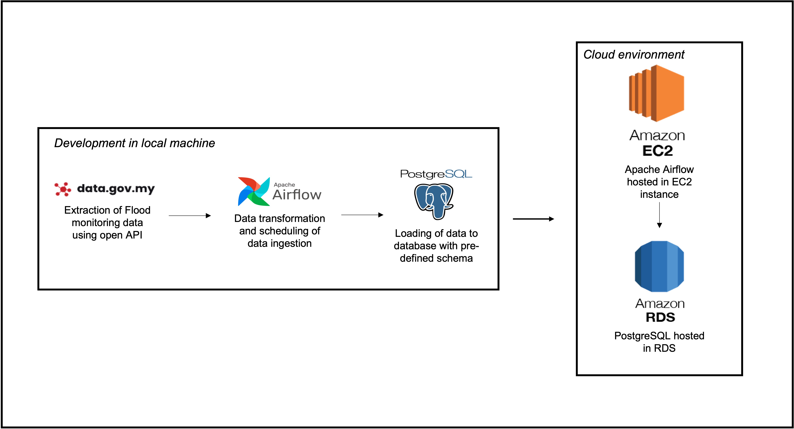

# 👋 Data ingestion to postgresql database using Apache Airflow as the  data orchestration tools

This project is prompted to extract the flood monitoring data through the open API recently published by the Malaysia government (https://data.gov.my/) as their latest initiative in providing the public with official open data. 



In regards to the flood monitoring data, the open API provide the public with water level and rainfall status data which are updated in 15 minutes in interval, covering various district in Malaysia. In this particular project, we only interested in the Klang district, located at Selangor which heavily impacted by flood event, thus the data ingestion only apply to this region in which the API request has specified the district to be 'Klang' as shown in the extract_load_data.py:

```

api_url = "http://api.data.gov.my/flood-warning"

params = {"filter": "Klang@district"}

```
For further API documentation, you may refer to https://developer.data.gov.my/

## 👋 The python packages used in this project

* Airflow : To schedule data ingestion to data base in 15 minutes interval
* Pandas : Use to transform response through requests module from json to dataframe
* sqlalchemy : Connect to postgres database and populate data 
* psycopg2 :  Connect to postgres database and populate data 

## 👋 The purpose of data ingestion

* The ingestion of data into cloud environment or local machine might enable us to perform forecasting using machine learning technique
* This focus will be continued in near future as part of my coming portfolio

